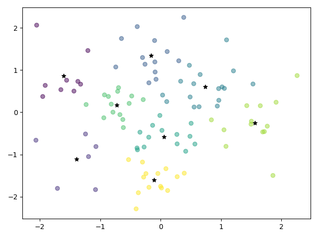

## Kmeans作业

### 原理简述

1. 在样本中随机选取$k$个样本点充当各个簇的中心点。

2. 计算所有样本点与各个簇中心之间的距离，然后把样本点划入**最近**的簇中，最近指的是使损失函数
   $$
   f(x) = \sum_{i=1}^{k} \sum_{x \in C_i} \Vert x-\mu_i \Vert^2
   $$
   值最小。其中，$Ci$为簇，$\mu_i$为$Ci$的中心点。

3. 根据簇中已有的样本点，重新计算簇**中心**。

4. 重复步骤2 - 3，直到样本分类不再变化（如，两次坐标中心点的变化小于一个阈值）。

### 坐标变化

具体的变化过程输出在控制台，这里展示开始的中心坐标和结束时的中心坐标。

#### 开始时


#### 结束时


### 核心代码

主要参考了K-Means, https://daya-jin.github.io/2018/09/22/KMeans/。

其实是对原理的一个“翻译”。

```python
while center_move > bias:
    # 计算距离
    for i in range(n_clusters):
        dist[:, i] = np.linalg.norm(data - cluster_centers[i], axis=1)
    # 标注类别
    labels = np.argmin(dist, axis=1)

    # 因为py的语言特性（默认浅拷贝），需要进行深拷贝
    current_center = deepcopy(cluster_centers)
    # 展示坐标变化
    print(current_center)

    # 更新center
    for i in range(n_clusters):
        cluster_centers[i] = np.mean(data[labels == i], axis=0)
    # 计算移动距离
    center_move = np.linalg.norm(cluster_centers - current_center)
```

### 实验结果

一共分成了8个簇。

